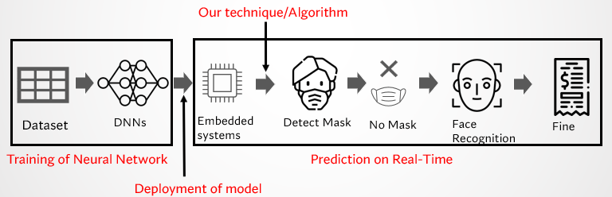

# Final Year Project
## Embedded Based Monitoring System Through DNNs
### Description
This project was made as a final year graduation project in which I build a monitoring system that comprises the different DNNs and runs on the resource constraint device like raspberry pi in such a way that our monitoring system gives fps and also gives us the required output.

For the validation of this project, we choose the face mask detector and face recognition system and combine them. Those who are not wearing a mask get detected and recognized and after that recognized person screenshot is emailed to the required authorities.
### Problems
Problems in this project that we usually face whenever we run a DNN on the resource constraint device are as follows.
1) Frame per second.
2) How do you tackle double detection of the same person?
3) What if the same person comes after some interval of time?
4) Which modules need to be run constantly? Face-mask detector or Face-recognition detector?
### Solution
The solution is as follows.

  

    Proposed Solution

As we can see the technique that we use before deploying the face mask and face recognition system that will be the **centroid object detector**. This centroid object detector will solve the above problems that we are facing.
- FPS will increase.
- There will be no double detection.
- There will be not need to contantly run the Face Mask and Face recognition system.

### Solution Explanation
The centroid object tracker will track the object that is in our case is the face of the person and give him the unique id until that person leaves the screen for 2, 3 sec. Whenever the new id is generated it will take the screenshot and save it in a folder as we can see it in the gif and images below.

  

  
  

After that when we press “Q” on the keyboard centroid tracker stops and our face-mask detector and face recognition start and process the saved images. When raspberry pi is done with all of the processing it shows us the processed images one by one and emails those images that got through the face recognition system to the administrator mail. Some images that got the system is as follows.

  
  

### Results
The results through this method is given in the figure below.

  

